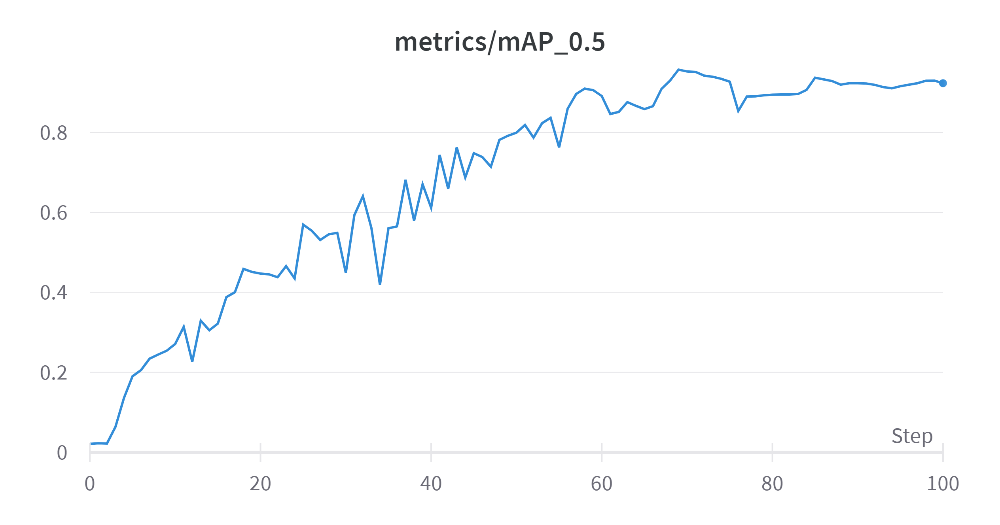
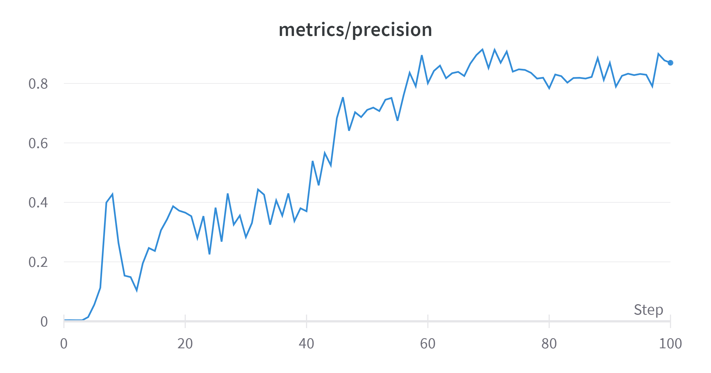
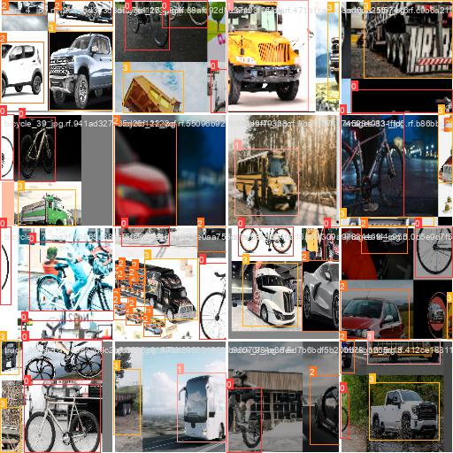

# Projeto Final - Modelos Preditivos Conexionistas

### Vitor Padilha Borba Pessoa Guerra - vpbpg@cesar.school

|**Tipo de Projeto**|**Modelo Selecionado**|**Linguagem**|
|---|---|---|
|Detecção de Objetos|YOLOv5s|Pytorch

## Introdução

Esse projeto teve como foco a identificação de veiculos de transporte terrestre. Utilizamos um aprendizado supervisionado para treinar 
uma rede neural a identificar diferentes tipos de veículos. Foram utilizadas 4 categorias de veículos: bicicleta, carro, ônibus e caminhão. 

A título de esclarecimento, carros como caminhonetes e pickups, por possuirem um compartimento de carga externo, foram classificados como caminhões. 

## Performance

O modelo treinado possui mAP (mean average precision) de **92,3%**.

### Output do bloco de treinamento

<details>
  <summary>Click to expand!</summary>
  
  ```text
  wandb: WARNING ⚠️ wandb is deprecated and will be removed in a future release. See supported integrations at https://github.com/ultralytics/yolov5#integrations.
wandb: Currently logged in as: vitorpbpguerra. Use `wandb login --relogin` to force relogin
train: weights=yolov5s.pt, cfg=, data=/content/yolov5/vehicles2-1/data.yaml, hyp=data/hyps/hyp.scratch-low.yaml, epochs=100, batch_size=50, imgsz=100, rect=False, resume=False, nosave=False, noval=False, noautoanchor=False, noplots=False, evolve=None, bucket=, cache=ram, image_weights=False, device=, multi_scale=False, single_cls=False, optimizer=SGD, sync_bn=False, workers=8, project=runs/train, name=exp, exist_ok=False, quad=False, cos_lr=False, label_smoothing=0.0, patience=100, freeze=[0], save_period=-1, seed=0, local_rank=-1, entity=None, upload_dataset=False, bbox_interval=-1, artifact_alias=latest
github: up to date with https://github.com/ultralytics/yolov5 ✅
requirements: /content/requirements.txt not found, check failed.
YOLOv5 🚀 v7.0-162-gc3e4e94 Python-3.10.11 torch-2.0.0+cu118 CUDA:0 (Tesla T4, 15102MiB)

hyperparameters: lr0=0.01, lrf=0.01, momentum=0.937, weight_decay=0.0005, warmup_epochs=3.0, warmup_momentum=0.8, warmup_bias_lr=0.1, box=0.05, cls=0.5, cls_pw=1.0, obj=1.0, obj_pw=1.0, iou_t=0.2, anchor_t=4.0, fl_gamma=0.0, hsv_h=0.015, hsv_s=0.7, hsv_v=0.4, degrees=0.0, translate=0.1, scale=0.5, shear=0.0, perspective=0.0, flipud=0.0, fliplr=0.5, mosaic=1.0, mixup=0.0, copy_paste=0.0
ClearML: run 'pip install clearml' to automatically track, visualize and remotely train YOLOv5 🚀 in ClearML
Comet: run 'pip install comet_ml' to automatically track and visualize YOLOv5 🚀 runs in Comet
TensorBoard: Start with 'tensorboard --logdir runs/train', view at http://localhost:6006/
wandb: Tracking run with wandb version 0.15.1
wandb: Run data is saved locally in /content/yolov5/wandb/run-20230503_190723-jeyp6gj6
wandb: Run `wandb offline` to turn off syncing.
wandb: Syncing run dainty-totem-13
wandb: ⭐️ View project at https://wandb.ai/vitorpbpguerra/YOLOv5
wandb: 🚀 View run at https://wandb.ai/vitorpbpguerra/YOLOv5/runs/jeyp6gj6
Overriding model.yaml nc=80 with nc=4

                 from  n    params  module                                  arguments                     
  0                -1  1      3520  models.common.Conv                      [3, 32, 6, 2, 2]              
  1                -1  1     18560  models.common.Conv                      [32, 64, 3, 2]                
  2                -1  1     18816  models.common.C3                        [64, 64, 1]                   
  3                -1  1     73984  models.common.Conv                      [64, 128, 3, 2]               
  4                -1  2    115712  models.common.C3                        [128, 128, 2]                 
  5                -1  1    295424  models.common.Conv                      [128, 256, 3, 2]              
  6                -1  3    625152  models.common.C3                        [256, 256, 3]                 
  7                -1  1   1180672  models.common.Conv                      [256, 512, 3, 2]              
  8                -1  1   1182720  models.common.C3                        [512, 512, 1]                 
  9                -1  1    656896  models.common.SPPF                      [512, 512, 5]                 
 10                -1  1    131584  models.common.Conv                      [512, 256, 1, 1]              
 11                -1  1         0  torch.nn.modules.upsampling.Upsample    [None, 2, 'nearest']          
 12           [-1, 6]  1         0  models.common.Concat                    [1]                           
 13                -1  1    361984  models.common.C3                        [512, 256, 1, False]          
 14                -1  1     33024  models.common.Conv                      [256, 128, 1, 1]              
 15                -1  1         0  torch.nn.modules.upsampling.Upsample    [None, 2, 'nearest']          
 16           [-1, 4]  1         0  models.common.Concat                    [1]                           
 17                -1  1     90880  models.common.C3                        [256, 128, 1, False]          
 18                -1  1    147712  models.common.Conv                      [128, 128, 3, 2]              
 19          [-1, 14]  1         0  models.common.Concat                    [1]                           
 20                -1  1    296448  models.common.C3                        [256, 256, 1, False]          
 21                -1  1    590336  models.common.Conv                      [256, 256, 3, 2]              
 22          [-1, 10]  1         0  models.common.Concat                    [1]                           
 23                -1  1   1182720  models.common.C3                        [512, 512, 1, False]          
 24      [17, 20, 23]  1     24273  models.yolo.Detect                      [4, [[10, 13, 16, 30, 33, 23], [30, 61, 62, 45, 59, 119], [116, 90, 156, 198, 373, 326]], [128, 256, 512]]
Model summary: 214 layers, 7030417 parameters, 7030417 gradients, 16.0 GFLOPs

Transferred 343/349 items from yolov5s.pt
AMP: checks passed ✅
WARNING ⚠️ --img-size 100 must be multiple of max stride 32, updating to 128
optimizer: SGD(lr=0.01) with parameter groups 57 weight(decay=0.0), 60 weight(decay=0.000390625), 60 bias
albumentations: Blur(p=0.01, blur_limit=(3, 7)), MedianBlur(p=0.01, blur_limit=(3, 7)), ToGray(p=0.01), CLAHE(p=0.01, clip_limit=(1, 4.0), tile_grid_size=(8, 8))
train: Scanning /content/yolov5/vehicles2-1/train/labels.cache... 142 images, 0 backgrounds, 0 corrupt: 100% 142/142 [00:00<?, ?it/s]
train: Caching images (0.0GB ram): 100% 142/142 [00:00<00:00, 190.31it/s]
val: Scanning /content/yolov5/vehicles2-1/valid/labels.cache... 40 images, 0 backgrounds, 0 corrupt: 100% 40/40 [00:00<?, ?it/s]
val: Caching images (0.0GB ram): 100% 40/40 [00:00<00:00, 72.55it/s]

AutoAnchor: 5.67 anchors/target, 0.994 Best Possible Recall (BPR). Current anchors are a good fit to dataset ✅
Plotting labels to runs/train/exp4/labels.jpg... 
Image sizes 128 train, 128 val
Using 2 dataloader workers
Logging results to runs/train/exp4
Starting training for 100 epochs...

      Epoch    GPU_mem   box_loss   obj_loss   cls_loss  Instances       Size
       0/99      0.56G     0.1167    0.01403     0.0485        148        128:   0% 0/3 [00:00<?, ?it/s]WARNING ⚠️ TensorBoard graph visualization failure Sizes of tensors must match except in dimension 1. Expected size 8 but got size 7 for tensor number 1 in the list.
       0/99     0.713G     0.1171    0.01399    0.04812        115        128: 100% 3/3 [00:02<00:00,  1.34it/s]
                 Class     Images  Instances          P          R      mAP50   mAP50-95: 100% 1/1 [00:00<00:00,  2.12it/s]
                   all         40         43    0.00364      0.873      0.021    0.00699

      Epoch    GPU_mem   box_loss   obj_loss   cls_loss  Instances       Size
       1/99     0.713G      0.116    0.01488    0.04766        123        128: 100% 3/3 [00:00<00:00,  7.27it/s]
                 Class     Images  Instances          P          R      mAP50   mAP50-95: 100% 1/1 [00:00<00:00,  3.73it/s]
                   all         40         43    0.00368      0.904     0.0226    0.00664

      Epoch    GPU_mem   box_loss   obj_loss   cls_loss  Instances       Size
       2/99     0.713G      0.112    0.01613     0.0479        124        128: 100% 3/3 [00:00<00:00,  4.21it/s]
                 Class     Images  Instances          P          R      mAP50   mAP50-95: 100% 1/1 [00:00<00:00,  3.47it/s]
                   all         40         43    0.00357      0.881     0.0218    0.00693

      Epoch    GPU_mem   box_loss   obj_loss   cls_loss  Instances       Size
       3/99     0.713G     0.1054    0.01854    0.04674        130        128: 100% 3/3 [00:00<00:00,  4.21it/s]
                 Class     Images  Instances          P          R      mAP50   mAP50-95: 100% 1/1 [00:00<00:00,  2.86it/s]
                   all         40         43    0.00343      0.862     0.0637     0.0198

      Epoch    GPU_mem   box_loss   obj_loss   cls_loss  Instances       Size
       4/99     0.713G     0.1021    0.01901    0.04635        125        128: 100% 3/3 [00:00<00:00,  4.87it/s]
                 Class     Images  Instances          P          R      mAP50   mAP50-95: 100% 1/1 [00:00<00:00,  3.54it/s]
                   all         40         43     0.0143      0.862      0.136       0.03

      Epoch    GPU_mem   box_loss   obj_loss   cls_loss  Instances       Size
       5/99     0.713G    0.09848    0.01981    0.04546        131        128: 100% 3/3 [00:00<00:00,  7.03it/s]
                 Class     Images  Instances          P          R      mAP50   mAP50-95: 100% 1/1 [00:00<00:00,  3.91it/s]
                   all         40         43     0.0555      0.414       0.19      0.059

      Epoch    GPU_mem   box_loss   obj_loss   cls_loss  Instances       Size
       6/99     0.713G    0.09384    0.02159    0.04573        129        128: 100% 3/3 [00:00<00:00,  6.74it/s]
                 Class     Images  Instances          P          R      mAP50   mAP50-95: 100% 1/1 [00:00<00:00,  3.84it/s]
                   all         40         43      0.113      0.349      0.206     0.0649

      Epoch    GPU_mem   box_loss   obj_loss   cls_loss  Instances       Size
       7/99     0.713G    0.09263    0.02256    0.04462        136        128: 100% 3/3 [00:00<00:00,  6.96it/s]
                 Class     Images  Instances          P          R      mAP50   mAP50-95: 100% 1/1 [00:00<00:00,  3.69it/s]
                   all         40         43        0.4      0.205      0.234     0.0762

      Epoch    GPU_mem   box_loss   obj_loss   cls_loss  Instances       Size
       8/99     0.713G    0.08548    0.02336    0.04372        131        128: 100% 3/3 [00:00<00:00,  6.88it/s]
                 Class     Images  Instances          P          R      mAP50   mAP50-95: 100% 1/1 [00:00<00:00,  3.90it/s]
                   all         40         43      0.427      0.227      0.244     0.0823

      Epoch    GPU_mem   box_loss   obj_loss   cls_loss  Instances       Size
       9/99     0.713G    0.08144    0.02517     0.0431        122        128: 100% 3/3 [00:00<00:00,  6.74it/s]
                 Class     Images  Instances          P          R      mAP50   mAP50-95: 100% 1/1 [00:00<00:00,  3.80it/s]
                   all         40         43      0.263      0.276      0.254     0.0992

      Epoch    GPU_mem   box_loss   obj_loss   cls_loss  Instances       Size
      10/99     0.713G    0.07702    0.02551    0.04189        116        128: 100% 3/3 [00:00<00:00,  6.48it/s]
                 Class     Images  Instances          P          R      mAP50   mAP50-95: 100% 1/1 [00:00<00:00,  3.89it/s]
                   all         40         43      0.154       0.25      0.271      0.109

      Epoch    GPU_mem   box_loss   obj_loss   cls_loss  Instances       Size
      11/99     0.713G    0.07655    0.02382    0.04132        140        128: 100% 3/3 [00:00<00:00,  7.16it/s]
                 Class     Images  Instances          P          R      mAP50   mAP50-95: 100% 1/1 [00:00<00:00,  3.73it/s]
                   all         40         43      0.149      0.231      0.314      0.134

      Epoch    GPU_mem   box_loss   obj_loss   cls_loss  Instances       Size
      12/99     0.713G    0.06991    0.02429    0.04102        127        128: 100% 3/3 [00:00<00:00,  6.41it/s]
                 Class     Images  Instances          P          R      mAP50   mAP50-95: 100% 1/1 [00:00<00:00,  3.10it/s]
                   all         40         43      0.104      0.334      0.226     0.0912

      Epoch    GPU_mem   box_loss   obj_loss   cls_loss  Instances       Size
      13/99     0.713G    0.06908    0.02433    0.04002        124        128: 100% 3/3 [00:00<00:00,  4.42it/s]
                 Class     Images  Instances          P          R      mAP50   mAP50-95: 100% 1/1 [00:00<00:00,  2.41it/s]
                   all         40         43      0.195       0.33      0.329      0.143

      Epoch    GPU_mem   box_loss   obj_loss   cls_loss  Instances       Size
      14/99     0.713G    0.06537    0.02524    0.04002        144        128: 100% 3/3 [00:00<00:00,  4.55it/s]
                 Class     Images  Instances          P          R      mAP50   mAP50-95: 100% 1/1 [00:00<00:00,  2.30it/s]
                   all         40         43      0.247      0.458      0.305      0.139

      Epoch    GPU_mem   box_loss   obj_loss   cls_loss  Instances       Size
      15/99     0.713G    0.06395    0.02281    0.03869        119        128: 100% 3/3 [00:00<00:00,  7.07it/s]
                 Class     Images  Instances          P          R      mAP50   mAP50-95: 100% 1/1 [00:00<00:00,  3.74it/s]
                   all         40         43      0.237        0.5      0.322      0.155

      Epoch    GPU_mem   box_loss   obj_loss   cls_loss  Instances       Size
      16/99     0.713G    0.06137    0.02265    0.03791        121        128: 100% 3/3 [00:00<00:00,  6.65it/s]
                 Class     Images  Instances          P          R      mAP50   mAP50-95: 100% 1/1 [00:00<00:00,  3.79it/s]
                   all         40         43      0.306       0.45      0.388      0.196

      Epoch    GPU_mem   box_loss   obj_loss   cls_loss  Instances       Size
      17/99     0.713G    0.05924    0.02011     0.0369        115        128: 100% 3/3 [00:00<00:00,  6.61it/s]
                 Class     Images  Instances          P          R      mAP50   mAP50-95: 100% 1/1 [00:00<00:00,  3.53it/s]
                   all         40         43      0.343      0.328        0.4       0.21

      Epoch    GPU_mem   box_loss   obj_loss   cls_loss  Instances       Size
      18/99     0.713G    0.05812     0.0196    0.03723        120        128: 100% 3/3 [00:00<00:00,  6.84it/s]
                 Class     Images  Instances          P          R      mAP50   mAP50-95: 100% 1/1 [00:00<00:00,  3.64it/s]
                   all         40         43      0.387      0.546      0.459      0.218

      Epoch    GPU_mem   box_loss   obj_loss   cls_loss  Instances       Size
      19/99     0.713G     0.0568     0.0202     0.0357        127        128: 100% 3/3 [00:00<00:00,  6.77it/s]
                 Class     Images  Instances          P          R      mAP50   mAP50-95: 100% 1/1 [00:00<00:00,  3.84it/s]
                   all         40         43      0.372      0.535      0.451      0.236

      Epoch    GPU_mem   box_loss   obj_loss   cls_loss  Instances       Size
      20/99     0.713G    0.05625    0.01821    0.03538        114        128: 100% 3/3 [00:00<00:00,  6.16it/s]
                 Class     Images  Instances          P          R      mAP50   mAP50-95: 100% 1/1 [00:00<00:00,  3.88it/s]
                   all         40         43      0.366      0.554      0.447      0.205

      Epoch    GPU_mem   box_loss   obj_loss   cls_loss  Instances       Size
      21/99     0.713G    0.05621    0.01872    0.03447        144        128: 100% 3/3 [00:00<00:00,  6.69it/s]
                 Class     Images  Instances          P          R      mAP50   mAP50-95: 100% 1/1 [00:00<00:00,  4.06it/s]
                   all         40         43      0.353      0.552      0.445      0.234

      Epoch    GPU_mem   box_loss   obj_loss   cls_loss  Instances       Size
      22/99     0.713G    0.05332    0.01654    0.03242        111        128: 100% 3/3 [00:00<00:00,  6.78it/s]
                 Class     Images  Instances          P          R      mAP50   mAP50-95: 100% 1/1 [00:00<00:00,  3.93it/s]
                   all         40         43       0.28      0.556      0.438      0.227

      Epoch    GPU_mem   box_loss   obj_loss   cls_loss  Instances       Size
      23/99     0.713G    0.05525    0.01776    0.03213        122        128: 100% 3/3 [00:00<00:00,  6.93it/s]
                 Class     Images  Instances          P          R      mAP50   mAP50-95: 100% 1/1 [00:00<00:00,  3.51it/s]
                   all         40         43      0.354      0.648      0.466      0.251

      Epoch    GPU_mem   box_loss   obj_loss   cls_loss  Instances       Size
      24/99     0.713G     0.0583     0.0186     0.0312        134        128: 100% 3/3 [00:00<00:00,  4.39it/s]
                 Class     Images  Instances          P          R      mAP50   mAP50-95: 100% 1/1 [00:00<00:00,  2.50it/s]
                   all         40         43      0.225      0.755      0.435      0.212

      Epoch    GPU_mem   box_loss   obj_loss   cls_loss  Instances       Size
      25/99     0.713G    0.05244    0.01781    0.03039        126        128: 100% 3/3 [00:00<00:00,  4.94it/s]
                 Class     Images  Instances          P          R      mAP50   mAP50-95: 100% 1/1 [00:00<00:00,  2.31it/s]
                   all         40         43      0.382      0.761      0.569        0.3

      Epoch    GPU_mem   box_loss   obj_loss   cls_loss  Instances       Size
      26/99     0.713G    0.05055    0.01654    0.02909        128        128: 100% 3/3 [00:00<00:00,  5.00it/s]
                 Class     Images  Instances          P          R      mAP50   mAP50-95: 100% 1/1 [00:00<00:00,  4.00it/s]
                   all         40         43      0.268      0.817      0.554      0.304

      Epoch    GPU_mem   box_loss   obj_loss   cls_loss  Instances       Size
      27/99     0.713G    0.05224    0.01625    0.02784        121        128: 100% 3/3 [00:00<00:00,  5.22it/s]
                 Class     Images  Instances          P          R      mAP50   mAP50-95: 100% 1/1 [00:00<00:00,  3.74it/s]
                   all         40         43       0.43      0.733      0.531      0.292

      Epoch    GPU_mem   box_loss   obj_loss   cls_loss  Instances       Size
      28/99     0.713G    0.05107    0.01665    0.02693        134        128: 100% 3/3 [00:00<00:00,  6.49it/s]
                 Class     Images  Instances          P          R      mAP50   mAP50-95: 100% 1/1 [00:00<00:00,  3.56it/s]
                   all         40         43      0.325      0.856      0.545      0.257

      Epoch    GPU_mem   box_loss   obj_loss   cls_loss  Instances       Size
      29/99     0.713G    0.05247    0.01686    0.02629        136        128: 100% 3/3 [00:00<00:00,  7.28it/s]
                 Class     Images  Instances          P          R      mAP50   mAP50-95: 100% 1/1 [00:00<00:00,  3.71it/s]
                   all         40         43      0.356      0.768      0.549      0.302

      Epoch    GPU_mem   box_loss   obj_loss   cls_loss  Instances       Size
      30/99     0.713G    0.04911    0.01645    0.02564        142        128: 100% 3/3 [00:00<00:00,  7.59it/s]
                 Class     Images  Instances          P          R      mAP50   mAP50-95: 100% 1/1 [00:00<00:00,  3.59it/s]
                   all         40         43      0.283      0.755      0.448       0.24

      Epoch    GPU_mem   box_loss   obj_loss   cls_loss  Instances       Size
      31/99     0.713G    0.05009    0.01513    0.02585        111        128: 100% 3/3 [00:00<00:00,  6.15it/s]
                 Class     Images  Instances          P          R      mAP50   mAP50-95: 100% 1/1 [00:00<00:00,  3.91it/s]
                   all         40         43      0.331      0.748      0.593      0.315

      Epoch    GPU_mem   box_loss   obj_loss   cls_loss  Instances       Size
      32/99     0.713G    0.04814    0.01508    0.02285        126        128: 100% 3/3 [00:00<00:00,  6.22it/s]
                 Class     Images  Instances          P          R      mAP50   mAP50-95: 100% 1/1 [00:00<00:00,  3.93it/s]
                   all         40         43      0.443      0.701       0.64      0.335

      Epoch    GPU_mem   box_loss   obj_loss   cls_loss  Instances       Size
      33/99     0.713G    0.04836    0.01568    0.02368        139        128: 100% 3/3 [00:00<00:00,  6.65it/s]
                 Class     Images  Instances          P          R      mAP50   mAP50-95: 100% 1/1 [00:00<00:00,  4.06it/s]
                   all         40         43      0.426      0.707      0.561      0.325

      Epoch    GPU_mem   box_loss   obj_loss   cls_loss  Instances       Size
      34/99     0.713G    0.04816    0.01559    0.02174        132        128: 100% 3/3 [00:00<00:00,  6.48it/s]
                 Class     Images  Instances          P          R      mAP50   mAP50-95: 100% 1/1 [00:00<00:00,  3.41it/s]
                   all         40         43      0.325      0.704      0.419      0.224

      Epoch    GPU_mem   box_loss   obj_loss   cls_loss  Instances       Size
      35/99     0.713G    0.04949    0.01476    0.02166        125        128: 100% 3/3 [00:00<00:00,  4.67it/s]
                 Class     Images  Instances          P          R      mAP50   mAP50-95: 100% 1/1 [00:00<00:00,  2.50it/s]
                   all         40         43      0.407      0.661       0.56      0.296

      Epoch    GPU_mem   box_loss   obj_loss   cls_loss  Instances       Size
      36/99     0.713G    0.04524    0.01477     0.0214        116        128: 100% 3/3 [00:00<00:00,  5.05it/s]
                 Class     Images  Instances          P          R      mAP50   mAP50-95: 100% 1/1 [00:00<00:00,  2.38it/s]
                   all         40         43      0.355       0.78      0.565      0.329

      Epoch    GPU_mem   box_loss   obj_loss   cls_loss  Instances       Size
      37/99     0.713G    0.04459    0.01465    0.02034        128        128: 100% 3/3 [00:00<00:00,  5.07it/s]
                 Class     Images  Instances          P          R      mAP50   mAP50-95: 100% 1/1 [00:00<00:00,  3.83it/s]
                   all         40         43       0.43       0.78      0.681      0.404

      Epoch    GPU_mem   box_loss   obj_loss   cls_loss  Instances       Size
      38/99     0.713G    0.04451    0.01525    0.01988        133        128: 100% 3/3 [00:00<00:00,  6.95it/s]
                 Class     Images  Instances          P          R      mAP50   mAP50-95: 100% 1/1 [00:00<00:00,  3.84it/s]
                   all         40         43      0.337      0.764      0.579      0.351

      Epoch    GPU_mem   box_loss   obj_loss   cls_loss  Instances       Size
      39/99     0.713G    0.04282    0.01459     0.0192        139        128: 100% 3/3 [00:00<00:00,  6.93it/s]
                 Class     Images  Instances          P          R      mAP50   mAP50-95: 100% 1/1 [00:00<00:00,  4.04it/s]
                   all         40         43       0.38      0.834       0.67      0.376

      Epoch    GPU_mem   box_loss   obj_loss   cls_loss  Instances       Size
      40/99     0.713G    0.04118    0.01445    0.01879        129        128: 100% 3/3 [00:00<00:00,  7.35it/s]
                 Class     Images  Instances          P          R      mAP50   mAP50-95: 100% 1/1 [00:00<00:00,  4.07it/s]
                   all         40         43       0.37      0.834      0.611      0.326

      Epoch    GPU_mem   box_loss   obj_loss   cls_loss  Instances       Size
      41/99     0.713G    0.04114    0.01417    0.01746        128        128: 100% 3/3 [00:00<00:00,  6.89it/s]
                 Class     Images  Instances          P          R      mAP50   mAP50-95: 100% 1/1 [00:00<00:00,  3.99it/s]
                   all         40         43       0.54      0.729      0.744      0.382

      Epoch    GPU_mem   box_loss   obj_loss   cls_loss  Instances       Size
      42/99     0.713G    0.04052    0.01316    0.01621        131        128: 100% 3/3 [00:00<00:00,  7.29it/s]
                 Class     Images  Instances          P          R      mAP50   mAP50-95: 100% 1/1 [00:00<00:00,  4.28it/s]
                   all         40         43      0.457      0.892      0.659      0.339

      Epoch    GPU_mem   box_loss   obj_loss   cls_loss  Instances       Size
      43/99     0.713G    0.03913    0.01356      0.018        121        128: 100% 3/3 [00:00<00:00,  6.68it/s]
                 Class     Images  Instances          P          R      mAP50   mAP50-95: 100% 1/1 [00:00<00:00,  4.10it/s]
                   all         40         43      0.566      0.911      0.763      0.428

      Epoch    GPU_mem   box_loss   obj_loss   cls_loss  Instances       Size
      44/99     0.713G    0.03928    0.01428    0.01629        118        128: 100% 3/3 [00:00<00:00,  7.27it/s]
                 Class     Images  Instances          P          R      mAP50   mAP50-95: 100% 1/1 [00:00<00:00,  3.60it/s]
                   all         40         43      0.525       0.77      0.687      0.347

      Epoch    GPU_mem   box_loss   obj_loss   cls_loss  Instances       Size
      45/99     0.713G    0.04096    0.01386      0.015        131        128: 100% 3/3 [00:00<00:00,  7.87it/s]
                 Class     Images  Instances          P          R      mAP50   mAP50-95: 100% 1/1 [00:00<00:00,  3.79it/s]
                   all         40         43      0.684      0.665      0.748      0.413

      Epoch    GPU_mem   box_loss   obj_loss   cls_loss  Instances       Size
      46/99     0.713G    0.04186    0.01466    0.01486        135        128: 100% 3/3 [00:00<00:00,  7.69it/s]
                 Class     Images  Instances          P          R      mAP50   mAP50-95: 100% 1/1 [00:00<00:00,  3.63it/s]
                   all         40         43      0.754      0.681      0.738      0.394

      Epoch    GPU_mem   box_loss   obj_loss   cls_loss  Instances       Size
      47/99     0.713G    0.03652    0.01371    0.01355        133        128: 100% 3/3 [00:00<00:00,  4.95it/s]
                 Class     Images  Instances          P          R      mAP50   mAP50-95: 100% 1/1 [00:00<00:00,  2.69it/s]
                   all         40         43      0.641      0.729      0.714      0.346

      Epoch    GPU_mem   box_loss   obj_loss   cls_loss  Instances       Size
      48/99     0.713G    0.04005    0.01393    0.01478        133        128: 100% 3/3 [00:00<00:00,  7.25it/s]
                 Class     Images  Instances          P          R      mAP50   mAP50-95: 100% 1/1 [00:00<00:00,  1.67it/s]
                   all         40         43      0.703      0.765      0.781      0.431

      Epoch    GPU_mem   box_loss   obj_loss   cls_loss  Instances       Size
      49/99     0.713G    0.03878    0.01308    0.01445        127        128: 100% 3/3 [00:00<00:00,  4.05it/s]
                 Class     Images  Instances          P          R      mAP50   mAP50-95: 100% 1/1 [00:00<00:00,  4.52it/s]
                   all         40         43      0.687      0.715      0.792      0.406

      Epoch    GPU_mem   box_loss   obj_loss   cls_loss  Instances       Size
      50/99     0.713G    0.03649     0.0133     0.0146        117        128: 100% 3/3 [00:00<00:00,  7.40it/s]
                 Class     Images  Instances          P          R      mAP50   mAP50-95: 100% 1/1 [00:00<00:00,  4.08it/s]
                   all         40         43      0.711      0.796      0.799      0.454

      Epoch    GPU_mem   box_loss   obj_loss   cls_loss  Instances       Size
      51/99     0.713G    0.03565    0.01254    0.01353        117        128: 100% 3/3 [00:00<00:00,  6.99it/s]
                 Class     Images  Instances          P          R      mAP50   mAP50-95: 100% 1/1 [00:00<00:00,  4.00it/s]
                   all         40         43      0.719      0.831      0.819      0.506

      Epoch    GPU_mem   box_loss   obj_loss   cls_loss  Instances       Size
      52/99     0.713G    0.03935    0.01398    0.01332        146        128: 100% 3/3 [00:00<00:00,  7.02it/s]
                 Class     Images  Instances          P          R      mAP50   mAP50-95: 100% 1/1 [00:00<00:00,  4.19it/s]
                   all         40         43      0.707      0.832      0.787      0.395

      Epoch    GPU_mem   box_loss   obj_loss   cls_loss  Instances       Size
      53/99     0.713G    0.03492    0.01275    0.01152        119        128: 100% 3/3 [00:00<00:00,  7.79it/s]
                 Class     Images  Instances          P          R      mAP50   mAP50-95: 100% 1/1 [00:00<00:00,  3.71it/s]
                   all         40         43      0.745      0.815      0.823       0.51

      Epoch    GPU_mem   box_loss   obj_loss   cls_loss  Instances       Size
      54/99     0.713G    0.03538    0.01247    0.01109        124        128: 100% 3/3 [00:00<00:00,  8.52it/s]
                 Class     Images  Instances          P          R      mAP50   mAP50-95: 100% 1/1 [00:00<00:00,  2.99it/s]
                   all         40         43      0.751      0.815      0.837      0.517

      Epoch    GPU_mem   box_loss   obj_loss   cls_loss  Instances       Size
      55/99     0.713G    0.03423    0.01228    0.01115        130        128: 100% 3/3 [00:00<00:00,  7.26it/s]
                 Class     Images  Instances          P          R      mAP50   mAP50-95: 100% 1/1 [00:00<00:00,  3.78it/s]
                   all         40         43      0.674      0.791      0.762      0.419

      Epoch    GPU_mem   box_loss   obj_loss   cls_loss  Instances       Size
      56/99     0.713G     0.0356    0.01295    0.01163        117        128: 100% 3/3 [00:00<00:00,  7.30it/s]
                 Class     Images  Instances          P          R      mAP50   mAP50-95: 100% 1/1 [00:00<00:00,  3.85it/s]
                   all         40         43       0.76      0.853      0.859      0.552

      Epoch    GPU_mem   box_loss   obj_loss   cls_loss  Instances       Size
      57/99     0.713G    0.03608    0.01338    0.01136        147        128: 100% 3/3 [00:00<00:00,  7.16it/s]
                 Class     Images  Instances          P          R      mAP50   mAP50-95: 100% 1/1 [00:00<00:00,  3.74it/s]
                   all         40         43      0.836      0.824      0.896      0.511

      Epoch    GPU_mem   box_loss   obj_loss   cls_loss  Instances       Size
      58/99     0.713G     0.0345      0.013    0.01075        117        128: 100% 3/3 [00:00<00:00,  7.54it/s]
                 Class     Images  Instances          P          R      mAP50   mAP50-95: 100% 1/1 [00:00<00:00,  3.84it/s]
                   all         40         43       0.79      0.843       0.91      0.543

      Epoch    GPU_mem   box_loss   obj_loss   cls_loss  Instances       Size
      59/99     0.713G    0.03453    0.01284   0.009481        143        128: 100% 3/3 [00:00<00:00,  4.71it/s]
                 Class     Images  Instances          P          R      mAP50   mAP50-95: 100% 1/1 [00:00<00:00,  2.49it/s]
                   all         40         43      0.895      0.864      0.906      0.502

      Epoch    GPU_mem   box_loss   obj_loss   cls_loss  Instances       Size
      60/99     0.713G    0.03442    0.01235   0.009563        131        128: 100% 3/3 [00:00<00:00,  4.63it/s]
                 Class     Images  Instances          P          R      mAP50   mAP50-95: 100% 1/1 [00:00<00:00,  2.52it/s]
                   all         40         43      0.801      0.851      0.891      0.572

      Epoch    GPU_mem   box_loss   obj_loss   cls_loss  Instances       Size
      61/99     0.713G    0.03462    0.01243   0.009839        144        128: 100% 3/3 [00:00<00:00,  7.79it/s]
                 Class     Images  Instances          P          R      mAP50   mAP50-95: 100% 1/1 [00:00<00:00,  4.11it/s]
                   all         40         43      0.842      0.806      0.846      0.456

      Epoch    GPU_mem   box_loss   obj_loss   cls_loss  Instances       Size
      62/99     0.713G    0.03442    0.01271   0.009348        136        128: 100% 3/3 [00:00<00:00,  6.68it/s]
                 Class     Images  Instances          P          R      mAP50   mAP50-95: 100% 1/1 [00:00<00:00,  4.43it/s]
                   all         40         43       0.86      0.834      0.851      0.505

      Epoch    GPU_mem   box_loss   obj_loss   cls_loss  Instances       Size
      63/99     0.713G    0.03316    0.01198    0.01013        114        128: 100% 3/3 [00:00<00:00,  7.05it/s]
                 Class     Images  Instances          P          R      mAP50   mAP50-95: 100% 1/1 [00:00<00:00,  3.88it/s]
                   all         40         43      0.817      0.837      0.876      0.556

      Epoch    GPU_mem   box_loss   obj_loss   cls_loss  Instances       Size
      64/99     0.713G    0.03377    0.01292   0.008617        128        128: 100% 3/3 [00:00<00:00,  6.74it/s]
                 Class     Images  Instances          P          R      mAP50   mAP50-95: 100% 1/1 [00:00<00:00,  3.95it/s]
                   all         40         43      0.834      0.845      0.867      0.532

      Epoch    GPU_mem   box_loss   obj_loss   cls_loss  Instances       Size
      65/99     0.713G    0.03172    0.01221   0.008474        121        128: 100% 3/3 [00:00<00:00,  6.87it/s]
                 Class     Images  Instances          P          R      mAP50   mAP50-95: 100% 1/1 [00:00<00:00,  4.18it/s]
                   all         40         43      0.839      0.873      0.858      0.515

      Epoch    GPU_mem   box_loss   obj_loss   cls_loss  Instances       Size
      66/99     0.713G    0.03062    0.01199     0.0095        129        128: 100% 3/3 [00:00<00:00,  7.43it/s]
                 Class     Images  Instances          P          R      mAP50   mAP50-95: 100% 1/1 [00:00<00:00,  4.06it/s]
                   all         40         43      0.825      0.883      0.866      0.539

      Epoch    GPU_mem   box_loss   obj_loss   cls_loss  Instances       Size
      67/99     0.713G    0.03111    0.01208   0.008822        126        128: 100% 3/3 [00:00<00:00,  6.59it/s]
                 Class     Images  Instances          P          R      mAP50   mAP50-95: 100% 1/1 [00:00<00:00,  3.88it/s]
                   all         40         43      0.867      0.892      0.909      0.579

      Epoch    GPU_mem   box_loss   obj_loss   cls_loss  Instances       Size
      68/99     0.713G     0.0315    0.01267   0.008874        124        128: 100% 3/3 [00:00<00:00,  7.15it/s]
                 Class     Images  Instances          P          R      mAP50   mAP50-95: 100% 1/1 [00:00<00:00,  4.04it/s]
                   all         40         43      0.895      0.892       0.93       0.57

      Epoch    GPU_mem   box_loss   obj_loss   cls_loss  Instances       Size
      69/99     0.713G    0.02858    0.01127   0.009243        103        128: 100% 3/3 [00:00<00:00,  6.64it/s]
                 Class     Images  Instances          P          R      mAP50   mAP50-95: 100% 1/1 [00:00<00:00,  4.28it/s]
                   all         40         43      0.914      0.885      0.957      0.604

      Epoch    GPU_mem   box_loss   obj_loss   cls_loss  Instances       Size
      70/99     0.713G    0.03294    0.01212   0.007719        149        128: 100% 3/3 [00:00<00:00,  6.38it/s]
                 Class     Images  Instances          P          R      mAP50   mAP50-95: 100% 1/1 [00:00<00:00,  2.94it/s]
                   all         40         43      0.852      0.931      0.952      0.564

      Epoch    GPU_mem   box_loss   obj_loss   cls_loss  Instances       Size
      71/99     0.713G    0.03014    0.01265   0.007465        118        128: 100% 3/3 [00:00<00:00,  4.14it/s]
                 Class     Images  Instances          P          R      mAP50   mAP50-95: 100% 1/1 [00:00<00:00,  2.70it/s]
                   all         40         43      0.913      0.899      0.951      0.594

      Epoch    GPU_mem   box_loss   obj_loss   cls_loss  Instances       Size
      72/99     0.713G    0.03167    0.01237   0.008003        132        128: 100% 3/3 [00:00<00:00,  4.50it/s]
                 Class     Images  Instances          P          R      mAP50   mAP50-95: 100% 1/1 [00:00<00:00,  2.58it/s]
                   all         40         43       0.87      0.871      0.942      0.522

      Epoch    GPU_mem   box_loss   obj_loss   cls_loss  Instances       Size
      73/99     0.713G    0.02776    0.01226    0.00758        125        128: 100% 3/3 [00:00<00:00,  5.56it/s]
                 Class     Images  Instances          P          R      mAP50   mAP50-95: 100% 1/1 [00:00<00:00,  3.85it/s]
                   all         40         43      0.907      0.913      0.939      0.583

      Epoch    GPU_mem   box_loss   obj_loss   cls_loss  Instances       Size
      74/99     0.713G    0.02841    0.01191   0.008681        135        128: 100% 3/3 [00:00<00:00,  7.40it/s]
                 Class     Images  Instances          P          R      mAP50   mAP50-95: 100% 1/1 [00:00<00:00,  3.76it/s]
                   all         40         43       0.84      0.899      0.934       0.51

      Epoch    GPU_mem   box_loss   obj_loss   cls_loss  Instances       Size
      75/99     0.713G    0.02847    0.01163   0.008649        126        128: 100% 3/3 [00:00<00:00,  7.59it/s]
                 Class     Images  Instances          P          R      mAP50   mAP50-95: 100% 1/1 [00:00<00:00,  3.65it/s]
                   all         40         43      0.847      0.874      0.927      0.577

      Epoch    GPU_mem   box_loss   obj_loss   cls_loss  Instances       Size
      76/99     0.713G    0.02827    0.01165   0.006873        127        128: 100% 3/3 [00:00<00:00,  7.47it/s]
                 Class     Images  Instances          P          R      mAP50   mAP50-95: 100% 1/1 [00:00<00:00,  3.29it/s]
                   all         40         43      0.845      0.856      0.854      0.571

      Epoch    GPU_mem   box_loss   obj_loss   cls_loss  Instances       Size
      77/99     0.713G    0.02904    0.01218   0.008411        131        128: 100% 3/3 [00:00<00:00,  7.48it/s]
                 Class     Images  Instances          P          R      mAP50   mAP50-95: 100% 1/1 [00:00<00:00,  3.50it/s]
                   all         40         43      0.836      0.896       0.89      0.524

      Epoch    GPU_mem   box_loss   obj_loss   cls_loss  Instances       Size
      78/99     0.713G    0.02821    0.01185   0.007865        111        128: 100% 3/3 [00:00<00:00,  6.62it/s]
                 Class     Images  Instances          P          R      mAP50   mAP50-95: 100% 1/1 [00:00<00:00,  4.03it/s]
                   all         40         43      0.816      0.893       0.89      0.584

      Epoch    GPU_mem   box_loss   obj_loss   cls_loss  Instances       Size
      79/99     0.713G    0.02855    0.01176   0.007252        105        128: 100% 3/3 [00:00<00:00,  7.47it/s]
                 Class     Images  Instances          P          R      mAP50   mAP50-95: 100% 1/1 [00:00<00:00,  3.74it/s]
                   all         40         43      0.819      0.902      0.893      0.617

      Epoch    GPU_mem   box_loss   obj_loss   cls_loss  Instances       Size
      80/99     0.713G    0.02803    0.01167   0.006253        119        128: 100% 3/3 [00:00<00:00,  6.94it/s]
                 Class     Images  Instances          P          R      mAP50   mAP50-95: 100% 1/1 [00:00<00:00,  3.41it/s]
                   all         40         43      0.784      0.924      0.894      0.629

      Epoch    GPU_mem   box_loss   obj_loss   cls_loss  Instances       Size
      81/99     0.713G    0.02576     0.0115   0.007023        128        128: 100% 3/3 [00:00<00:00,  8.03it/s]
                 Class     Images  Instances          P          R      mAP50   mAP50-95: 100% 1/1 [00:00<00:00,  3.15it/s]
                   all         40         43       0.83      0.905      0.895        0.6

      Epoch    GPU_mem   box_loss   obj_loss   cls_loss  Instances       Size
      82/99     0.713G     0.0285    0.01137   0.006705        125        128: 100% 3/3 [00:00<00:00,  7.89it/s]
                 Class     Images  Instances          P          R      mAP50   mAP50-95: 100% 1/1 [00:00<00:00,  3.40it/s]
                   all         40         43      0.824      0.907      0.895      0.596

      Epoch    GPU_mem   box_loss   obj_loss   cls_loss  Instances       Size
      83/99     0.713G    0.02602     0.0115   0.006048        128        128: 100% 3/3 [00:00<00:00,  4.18it/s]
                 Class     Images  Instances          P          R      mAP50   mAP50-95: 100% 1/1 [00:00<00:00,  3.15it/s]
                   all         40         43      0.803      0.933      0.896      0.598

      Epoch    GPU_mem   box_loss   obj_loss   cls_loss  Instances       Size
      84/99     0.713G    0.02792    0.01252   0.006919        143        128: 100% 3/3 [00:00<00:00,  4.96it/s]
                 Class     Images  Instances          P          R      mAP50   mAP50-95: 100% 1/1 [00:00<00:00,  2.40it/s]
                   all         40         43      0.818      0.938      0.906      0.586

      Epoch    GPU_mem   box_loss   obj_loss   cls_loss  Instances       Size
      85/99     0.713G    0.02677    0.01099   0.006719        146        128: 100% 3/3 [00:00<00:00,  4.70it/s]
                 Class     Images  Instances          P          R      mAP50   mAP50-95: 100% 1/1 [00:00<00:00,  2.84it/s]
                   all         40         43      0.819      0.942      0.937      0.592

      Epoch    GPU_mem   box_loss   obj_loss   cls_loss  Instances       Size
      86/99     0.713G    0.02565    0.01095    0.00596        123        128: 100% 3/3 [00:00<00:00,  6.63it/s]
                 Class     Images  Instances          P          R      mAP50   mAP50-95: 100% 1/1 [00:00<00:00,  3.91it/s]
                   all         40         43      0.816       0.94      0.933      0.617

      Epoch    GPU_mem   box_loss   obj_loss   cls_loss  Instances       Size
      87/99     0.713G    0.02577    0.01147   0.006062        143        128: 100% 3/3 [00:00<00:00,  7.25it/s]
                 Class     Images  Instances          P          R      mAP50   mAP50-95: 100% 1/1 [00:00<00:00,  3.92it/s]
                   all         40         43      0.822      0.939      0.929      0.589

      Epoch    GPU_mem   box_loss   obj_loss   cls_loss  Instances       Size
      88/99     0.713G    0.02775    0.01183   0.007346        126        128: 100% 3/3 [00:00<00:00,  7.02it/s]
                 Class     Images  Instances          P          R      mAP50   mAP50-95: 100% 1/1 [00:00<00:00,  3.79it/s]
                   all         40         43      0.885      0.856       0.92      0.591

      Epoch    GPU_mem   box_loss   obj_loss   cls_loss  Instances       Size
      89/99     0.713G    0.02646      0.011   0.005991        118        128: 100% 3/3 [00:00<00:00,  6.62it/s]
                 Class     Images  Instances          P          R      mAP50   mAP50-95: 100% 1/1 [00:00<00:00,  4.09it/s]
                   all         40         43      0.812      0.914      0.923      0.616

      Epoch    GPU_mem   box_loss   obj_loss   cls_loss  Instances       Size
      90/99     0.713G    0.02598    0.01073    0.00574        123        128: 100% 3/3 [00:00<00:00,  6.68it/s]
                 Class     Images  Instances          P          R      mAP50   mAP50-95: 100% 1/1 [00:00<00:00,  4.10it/s]
                   all         40         43      0.869      0.856      0.923      0.632

      Epoch    GPU_mem   box_loss   obj_loss   cls_loss  Instances       Size
      91/99     0.713G    0.02714    0.01103   0.006603        134        128: 100% 3/3 [00:00<00:00,  7.07it/s]
                 Class     Images  Instances          P          R      mAP50   mAP50-95: 100% 1/1 [00:00<00:00,  4.03it/s]
                   all         40         43      0.789       0.95      0.922      0.598

      Epoch    GPU_mem   box_loss   obj_loss   cls_loss  Instances       Size
      92/99     0.713G    0.02378    0.01126   0.005566        111        128: 100% 3/3 [00:00<00:00,  6.57it/s]
                 Class     Images  Instances          P          R      mAP50   mAP50-95: 100% 1/1 [00:00<00:00,  3.79it/s]
                   all         40         43      0.826      0.887      0.919      0.618

      Epoch    GPU_mem   box_loss   obj_loss   cls_loss  Instances       Size
      93/99     0.713G    0.02585    0.01104   0.005315        131        128: 100% 3/3 [00:00<00:00,  7.10it/s]
                 Class     Images  Instances          P          R      mAP50   mAP50-95: 100% 1/1 [00:00<00:00,  3.53it/s]
                   all         40         43      0.833      0.892      0.913      0.617

      Epoch    GPU_mem   box_loss   obj_loss   cls_loss  Instances       Size
      94/99     0.713G    0.02764    0.01161   0.006003        122        128: 100% 3/3 [00:00<00:00,  7.08it/s]
                 Class     Images  Instances          P          R      mAP50   mAP50-95: 100% 1/1 [00:00<00:00,  4.10it/s]
                   all         40         43      0.828      0.892       0.91      0.615

      Epoch    GPU_mem   box_loss   obj_loss   cls_loss  Instances       Size
      95/99     0.713G    0.02728    0.01146   0.005273        126        128: 100% 3/3 [00:00<00:00,  6.87it/s]
                 Class     Images  Instances          P          R      mAP50   mAP50-95: 100% 1/1 [00:00<00:00,  2.32it/s]
                   all         40         43      0.832      0.892      0.916      0.613

      Epoch    GPU_mem   box_loss   obj_loss   cls_loss  Instances       Size
      96/99     0.713G    0.02478    0.01111   0.005844        131        128: 100% 3/3 [00:00<00:00,  4.60it/s]
                 Class     Images  Instances          P          R      mAP50   mAP50-95: 100% 1/1 [00:00<00:00,  2.73it/s]
                   all         40         43      0.829      0.892      0.919      0.611

      Epoch    GPU_mem   box_loss   obj_loss   cls_loss  Instances       Size
      97/99     0.713G    0.02395    0.01107   0.006056        118        128: 100% 3/3 [00:00<00:00,  4.81it/s]
                 Class     Images  Instances          P          R      mAP50   mAP50-95: 100% 1/1 [00:00<00:00,  2.60it/s]
                   all         40         43       0.79      0.925      0.923      0.622

      Epoch    GPU_mem   box_loss   obj_loss   cls_loss  Instances       Size
      98/99     0.713G    0.02294    0.01059   0.006173        127        128: 100% 3/3 [00:00<00:00,  4.83it/s]
                 Class     Images  Instances          P          R      mAP50   mAP50-95: 100% 1/1 [00:00<00:00,  3.70it/s]
                   all         40         43      0.899       0.84      0.929      0.623

      Epoch    GPU_mem   box_loss   obj_loss   cls_loss  Instances       Size
      99/99     0.713G    0.02485    0.01132   0.004459        135        128: 100% 3/3 [00:00<00:00,  6.81it/s]
                 Class     Images  Instances          P          R      mAP50   mAP50-95: 100% 1/1 [00:00<00:00,  4.03it/s]
                   all         40         43      0.878      0.848       0.93      0.617

100 epochs completed in 0.035 hours.
Optimizer stripped from runs/train/exp4/weights/last.pt, 14.2MB
Optimizer stripped from runs/train/exp4/weights/best.pt, 14.2MB

Validating runs/train/exp4/weights/best.pt...
Fusing layers... 
Model summary: 157 layers, 7020913 parameters, 0 gradients, 15.8 GFLOPs
                 Class     Images  Instances          P          R      mAP50   mAP50-95: 100% 1/1 [00:00<00:00,  3.79it/s]
                   all         40         43      0.869      0.856      0.923      0.631
               bicycle         40         11      0.976          1      0.995      0.684
                   bus         40          8          1      0.731      0.967      0.606
                   car         40         11      0.765          1      0.901      0.718
                 truck         40         13      0.737      0.692      0.829      0.517
Results saved to runs/train/exp4
wandb: Waiting for W&B process to finish... (success).
wandb: 
wandb: Run history:
wandb:      metrics/mAP_0.5 ▁▁▂▃▃▃▃▄▄▄▅▅▄▅▅▅▆▇▆▇▇▇▇█▇▇▇███▇█████████
wandb: metrics/mAP_0.5:0.95 ▁▁▂▂▂▂▃▃▃▄▄▄▄▅▄▅▅▆▅▆▇▇▇▇▆▇▇██▇▇██▇██████
wandb:    metrics/precision ▁▁▁▄▂▂▃▄▄▄▄▃▃▄▄▄▅▅▇▆▆▇▇▇▇▇▇██▇▇▇▇▇▇▇▇▇▇█
wandb:       metrics/recall ▇▇▃▁▁▂▄▂▄▅▆▇▆▆▅▆▆█▆▆▇▇▇▇▇▇▇▇██▇████████▇
wandb:       train/box_loss ██▇▆▅▄▄▄▃▃▃▃▃▃▃▂▂▂▂▂▂▂▂▂▂▂▁▂▁▁▁▁▁▁▁▁▁▁▁▁
wandb:       train/cls_loss ███▇▇▇▆▆▆▅▅▅▄▄▄▃▃▃▃▃▃▂▂▂▂▂▂▂▁▂▁▂▁▁▁▁▁▁▁▁
wandb:       train/obj_loss ▂▃▅▇█▇▇▅▄▄▄▄▄▃▃▃▃▂▂▂▂▂▂▂▂▁▁▂▂▂▁▁▁▁▁▁▁▁▁▁
wandb:         val/box_loss █▇▆▅▄▄▃▃▄▃▃▃▃▃▃▃▂▂▂▂▂▂▁▂▂▁▁▁▁▁▁▁▁▁▁▁▁▁▁▁
wandb:         val/cls_loss ██▇▇▆▆▆▅▅▅▄▄▄▄▃▃▃▃▂▂▂▂▂▁▂▂▂▁▁▁▁▁▁▁▁▁▁▁▁▁
wandb:         val/obj_loss ▁▂▆▇███▇█▅▄▄▄▄▃▃▂▂▂▂▂▂▁▂▂▁▁▁▁▁▁▁▁▁▁▁▁▁▁▁
wandb:                x/lr0 ██▇▇▆▆▅▅▄▄▃▃▂▁▁▁▁▁▁▁▁▁▁▁▁▁▁▁▁▁▁▁▁▁▁▁▁▁▁▁
wandb:                x/lr1 ▁▂▃▃▄▄▅▆▆▆▇▇████▇▇▇▇▆▆▆▅▅▅▅▄▄▄▄▃▃▃▂▂▂▂▁▁
wandb:                x/lr2 ▁▂▃▃▄▄▅▆▆▆▇▇████▇▇▇▇▆▆▆▅▅▅▅▄▄▄▄▃▃▃▂▂▂▂▁▁
wandb: 
wandb: Run summary:
wandb:           best/epoch 90
wandb:         best/mAP_0.5 0.92307
wandb:    best/mAP_0.5:0.95 0.63218
wandb:       best/precision 0.86928
wandb:          best/recall 0.8559
wandb:      metrics/mAP_0.5 0.92307
wandb: metrics/mAP_0.5:0.95 0.63128
wandb:    metrics/precision 0.86944
wandb:       metrics/recall 0.85585
wandb:       train/box_loss 0.02485
wandb:       train/cls_loss 0.00446
wandb:       train/obj_loss 0.01132
wandb:         val/box_loss 0.02631
wandb:         val/cls_loss 0.00897
wandb:         val/obj_loss 0.00396
wandb:                x/lr0 0.0003
wandb:                x/lr1 0.0003
wandb:                x/lr2 0.0003
wandb: 
wandb: 🚀 View run dainty-totem-13 at: https://wandb.ai/vitorpbpguerra/YOLOv5/runs/jeyp6gj6
wandb: Synced 5 W&B file(s), 13 media file(s), 1 artifact file(s) and 0 other file(s)
wandb: Find logs at: ./wandb/run-20230503_190723-jeyp6gj6/logs
wandb: WARNING ⚠️ wandb is deprecated and will be removed in a future release. See supported integrations at https://github.com/ultralytics/yolov5#integrations.
  ```
</details>


### Evidências de Treinamento

Abaixo temos alguns resultados desse treinamento: 





Temos também um exemplo de um batch das imagens que foram utilizadas no treinamento: 



Como pode ser observado, nem todas as imagens possuiam um veículo inteiro, as vezes apenas parte dele estava contida

## Roboflow 

O dataset de imagens utilizadas pode ser verificado no roboflow através desse [link](https://universe.roboflow.com/redes-neurais/vehicles2-qkyjp/browse?queryText=&pageSize=50&startingIndex=0&browseQuery=true)

